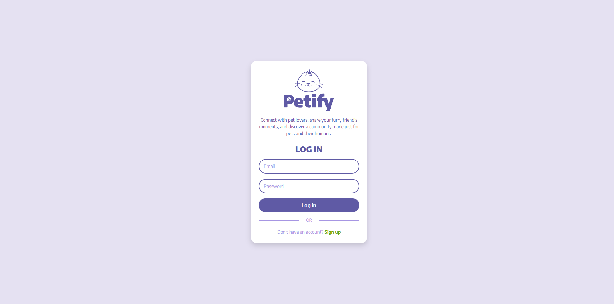
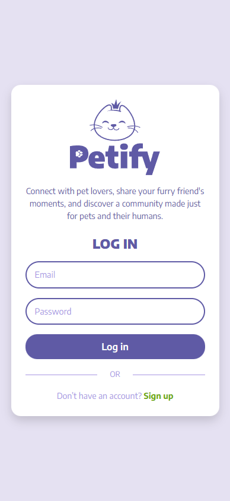
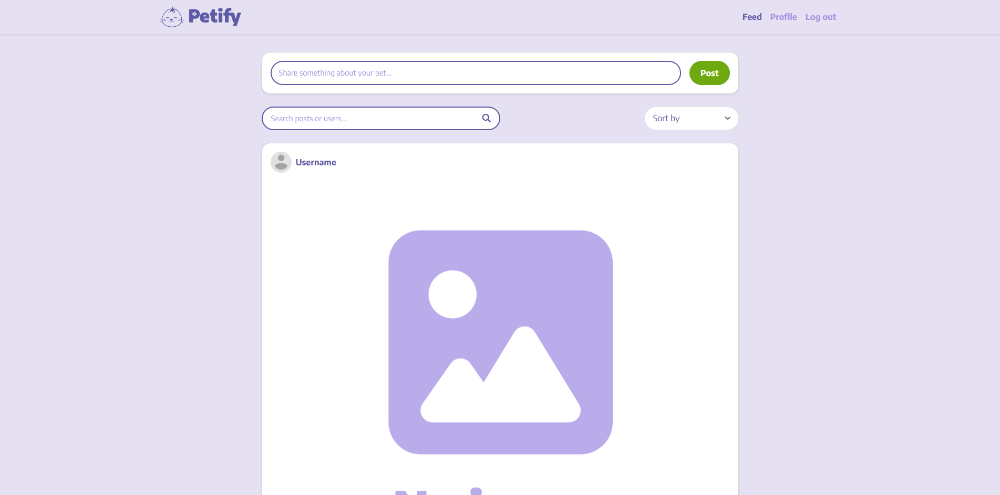
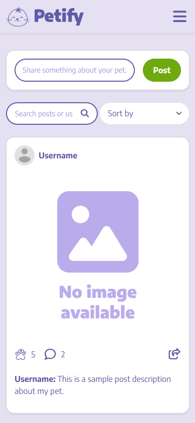
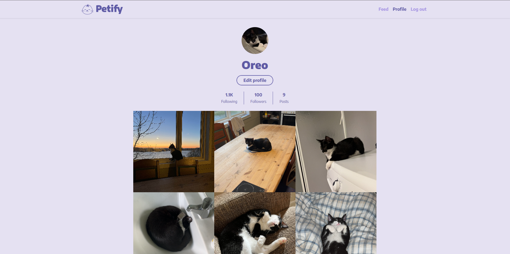
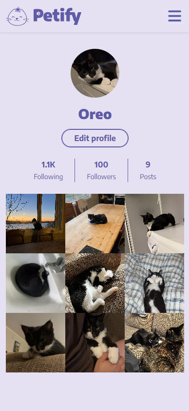

# Petify 🐾


A responsive social media front-end for pets — built with Bootstrap 5 and Sass for my Noroff CSS Frameworks course assignment.

## Table of Contents  
1. [Project Overview](#project-overview)
2. [Pages](#pages)
3. [Features](#features)
4. [Style Guide](#style-guide)
5. [Tech Stack](#tech-stack)
6. [Installation](#installation)
7. [Screenshots](#screenshots)

## Project Overview  
**Petify** is a **pet-themed** social media prototype designed as part of the Noroff CSS Frameworks course.
The goal was to create a fully responsive front-end using Bootstrap and Sass, showcasing a consistent design system and layout across pages.

This project demonstrates how to:

- Implement and customize Bootstrap components
- Apply Sass for scalable, maintainable styling
- Design layouts that adapt across screen sizes

This website focuses purely on UI and layout, no JavaScript or backend functionality is included in this version.

## Pages
| Page               | Endpoint            | Description                                                                |
|--------------------|---------------------|----------------------------------------------------------------------------|
| Authentication Page| /index.html         | A login/register form with HTML validation (password min length 8, required fields).|
| Feed Page          | feed/index.html     | Displays a feed layout with posts, search bar, and a “create post” form section.|
| Profile Page       | profile/index.html  | Shows the user’s profile picture, follower/following section, and a grid of post thumbnails.|

## Features  
- Built entirely with Bootstrap 5 classes 
- Organized Sass structure with variables and partials
- Fully responsive design for mobile, tablet, and desktop
- HTML form validation (login/register form)
- Sticky navbar across all pages
- Consistent design and color palette

## Style Guide  
**Colors:**  
- <span style="color:#e5e1f2; font-weight:bold;">Primary Light</span>:  `#e5e1f2`  
- <span style="color:#5f5aa5; font-weight:bold;">Primary Dark</span>:  `#5f5aa5`  
- <span style="color:#baaceb; font-weight:bold;">Secondary Light</span>:  `#baaceb`  
- <span style="color:#a796e3; font-weight:bold;">Secondary Darker</span>:  `#a796e3`  
- <span style="color:#6da90f; font-weight:bold;">Accent</span>:  `#6da90f`  
- <span style="color:#e67aae; font-weight:bold;">Warning</span>:  `#e67aae`  

**Fonts:**  
- Body & headings: Encode Sans (google fonts)

**Icons:**  
- [Font Awesome]([https://ionic.io/ionicons](https://fontawesome.com/)) used throughout the app

## Tech Stack  
- **Bootstrap 5** (installed via npm)
- **Sass** (compiled via npm scripts)
- **HTML5 & CSS3** 
- **Font Awesome 6**

**npm scripts:**
   ```bash
    "scripts": {
        "watch": "sass --watch scss/main.scss css/main.css",
        "build": "sass --style=compressed scss/main.scss css/main.css"
     }
```

## Installation  
To get a local copy of this project up and running:  

1. Clone the repo:  
   ```bash
   git clone https://github.com/your-username/petify.git
   cd petify

2. Install dependencies:
   ```bash
   npm install

3. Start the development server:
   ```bash
   npm run dev

4. Open the app in your browser:
   ```bash
   http://localhost:3000

Then open `index.html` in your browser.

## Screenshots
### Authentication Page
<p float="left">
  
  
</p>

---

### Feed Page
<p float="left">
  
  
</p>

---

### Profile Page
<p float="left">
  
  
</p>
